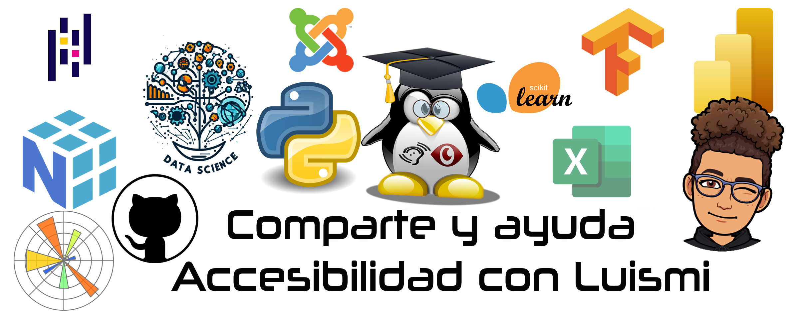

## Luis Miguel Andújar 👋

### About Me
- Tengo 53 años y soy de Sopela, Bizkaia, España.
- Llevo muchos años de profesor de nuevas tecnologías tanto a particulares como a empresas.
- Soy una persona autodidacta y altamente creativa que busca aprender y mejorar día a día.
- Me gusta trabajar con grupos tanto pequeños como grades dando a conocer mi conocimiento a los demás.

### Technologies
  
  
  
  
  
  
  
  
  
  
   
  
  
  
  
  
  
  
  
  

### Contact Me

<!--  -->
  

-----

 

## <b> Github Stats </b>
 

 

  

<!-- 

  

<!--
**Urioste06/Urioste06** is a ✨ _special_ ✨ repository because its `README.md` (this file) appears on your GitHub profile.

Here are some ideas to get you started:

- 🔭 I’m currently working on ...
- 🌱 I’m currently learning ...
- 👯 I’m looking to collaborate on ...
- 🤔 I’m looking for help with ...
- 💬 Ask me about ...
- 📫 How to reach me: ...
- 😄 Pronouns: ...
- ⚡ Fun fact: ...
-->
